# Orion Architecture Diagram

This diagram reflects the current repository structure and runtime flow across the local UI, HTTP API, orchestration layer, optional enrichments, and SQLite persistence.

```mermaid
flowchart TB
    user[Analyst / Operator]
    browser[Browser UI<br/>frontend/static/*]
    launcher[CLI Launcher<br/>local server entrypoint]
    server[Loopback HTTP Server<br/>frontend/server.py]

    subgraph api[API Surface]
        cases[Case APIs<br/>create/list/update/delete<br/>demo export notes]
        collect[Collection APIs<br/>sync collect<br/>async start/status]
        recon[Recon APIs<br/>recon / recon/stream]
        posts[Post APIs<br/>query manual ingest<br/>assessment updates]
        config[Config APIs<br/>load/save settings]
        entities[Known Entity APIs<br/>archive match restore]
        session[Session API<br/>clear local state / shutdown]
    end

    subgraph services[Core Services]
        collection_service[Collection Service<br/>target parsing and orchestration]
        collection_jobs[Background Job Manager<br/>async collection lifecycle]
        recon_service[Recon Service<br/>selector enrichment and screenshots]
        post_query[Post Query / Tagging<br/>search, filters, and signals]
        llm[LLM Warning Assessment<br/>optional assessment workflow]
        face[Face Recognition Engine<br/>media clustering workflow]
        app_config[Config Store<br/>local settings and secrets]
    end

    subgraph collectors[Collection Connectors]
        twitter[Twitter/X Collector]
        reddit[Reddit Collector]
        tiktok[TikTok Collector]
        bluesky[Bluesky Collector]
        instagram[Instagram Collector]
        youtube[YouTube Collector]
        apify[Apify-backed actors<br/>for supported platforms]
        playwright[Playwright fallback<br/>screenshots / browser collection]
    end

    subgraph external[Optional External Services]
        pdl[People Data Labs]
        osinti[OSINT Industries]
        numverify[Numverify]
        openai[OpenAI API]
        public_sites[Public social platforms]
    end

    subgraph storage[Local Persistence]
        sqlite[(SQLite<br/>osint_data.db)]
        cases_tbl[cases table]
        posts_tbl[twitter_posts table<br/>stores all platforms]
        config_file[Local config file]
        secrets_file[Encrypted secrets file]
        screenshots[frontend/static/recon_shots/*]
    end

    user --> browser
    launcher --> server
    browser --> server

    server --> cases
    server --> collect
    server --> recon
    server --> posts
    server --> config
    server --> entities
    server --> session

    cases --> sqlite
    posts --> post_query
    posts --> llm
    posts --> face
    config --> app_config
    recon --> recon_service
    collect --> collection_service
    collect --> collection_jobs
    entities --> sqlite
    session --> sqlite
    session --> app_config

    collection_jobs --> collection_service
    collection_service --> twitter
    collection_service --> reddit
    collection_service --> tiktok
    collection_service --> bluesky
    collection_service --> instagram
    collection_service --> youtube

    twitter --> public_sites
    reddit --> public_sites
    tiktok --> public_sites
    bluesky --> public_sites
    instagram --> public_sites
    youtube --> public_sites

    twitter -. optional .-> apify
    tiktok -. optional .-> apify
    instagram -. optional .-> apify
    twitter -. fallback .-> playwright
    tiktok -. fallback .-> playwright
    instagram -. fallback .-> playwright

    collection_service --> sqlite
    post_query --> sqlite
    llm --> sqlite
    face --> sqlite

    recon_service --> public_sites
    recon_service -. optional enrichment .-> pdl
    recon_service -. optional enrichment .-> osinti
    recon_service -. optional enrichment .-> numverify
    recon_service -. optional screenshots .-> playwright
    recon_service --> screenshots

    llm -. optional .-> openai
    app_config --> config_file
    app_config --> secrets_file
    sqlite --> cases_tbl
    sqlite --> posts_tbl
```

## Runtime interpretation

- Orion is a local-first system: the browser UI talks only to the loopback HTTP server in `frontend/server.py`.
- `frontend/server.py` is the control plane. It serves static assets, enforces loopback-only API access, and dispatches requests into collection, recon, query, config, LLM, and case-storage modules.
- Collection has two execution paths: direct synchronous collection and background jobs, both of which delegate to the collection orchestration layer.
- Source-specific collectors normalize data into a shared post shape before persistence in SQLite.
- Recon is separate from post collection. It checks public profiles, can capture screenshots, and can optionally enrich results with People Data Labs, OSINT Industries, and Numverify.
- The single SQLite database is the main system of record for cases and posts. Additional local state includes non-secret settings, optional encrypted secrets, and screenshot assets.
- Optional analysis paths hang off stored posts: LLM warning assessment adds `metadata.llm_assessment`, and face recognition clusters media when the required local ML dependencies are available.
